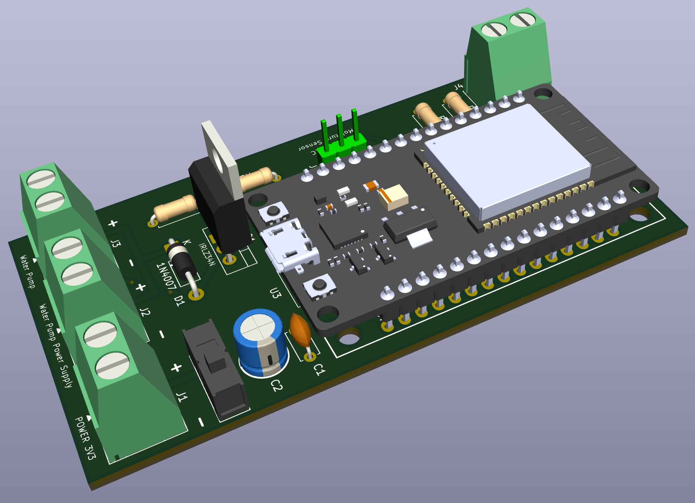

# 🔌 Garden Irrigation System — PCB Hardware

A custom-designed PCB built around the ESP32 DevKit V1, created as part of my personal journey into electronics, IoT, and robotics. The board was designed in **KiCad 10** after several weeks of self-taught KiCad and electronics study.

## Overview

The board's primary purpose is to control a 12V water pump via a MOSFET transistor, as part of the automated garden irrigation system. It integrates power management monitoring, soil moisture sensing, pump control, and a safe programming switch into a single compact board.

## Features

### Soil Moisture Sensing
The board interfaces with a capacitive soil moisture sensor (HW-080) connected to the ESP32's ADC. The sensor provides real-time soil moisture readings that the microcontroller uses to decide whether to activate the water pump. If moisture drops below the configured threshold, the pump is triggered automatically.

### Pump Control via MOSFET
The water pump is switched on and off by a MOSFET transistor (1N4007 flyback diode included for protection against voltage spikes from the inductive pump load). The ESP32 drives the MOSFET gate directly from a GPIO pin.

### Power Supply
The ESP32 and board logic are powered by a custom-designed 3.3V solar-powered power management module:

👉 [Solar-Powered 3.3V Power Management PCB](https://github.com/jedrekdomanski/solar-charger-pcb)

The board includes battery voltage monitoring, allowing the firmware to track the power module's battery level.

### USB Programming Switch
A slide switch allows safe switching between two modes:

- **3.3V power on** — normal operation, powered by the power management module
- **3.3V power off + USB connected** — firmware upload mode

When flashing a firmware update, the workflow is:
1. Flip the slide switch to cut the 3.3V supply
2. Connect the USB cable to the ESP32
3. Upload the firmware via PlatformIO
4. Disconnect USB, flip the switch back to restore 3.3V power

This prevents conflicts between the USB power rail and the external 3.3V supply during programming.

## Components

| Component | Details |
|---|---|
| ESP32 DevKit V1 | Main microcontroller — WiFi, deep sleep, ADC |
| HW-080 capacitive soil moisture sensor | GPIO 32 (ADC) — triggers pump when moisture is too low |
| MOSFET transistor | Controls the 12V water pump via GPIO 27 |
| 1N4007 diode | Flyback protection for the pump |
| Slide switch | Isolates 3.3V supply during USB programming |
| Power management module | Custom 3.3V solar-powered PCB (see link above) |

## Design

Designed in **KiCad 10** — schematic and PCB layout files are located in this directory:

- `ESP32_Irrigation_system.kicad_sch` — schematic
- `ESP32_Irrigation_system.kicad_pcb` — PCB layout
- `ESP32_Irrigation_system.kicad_pro` — project file
